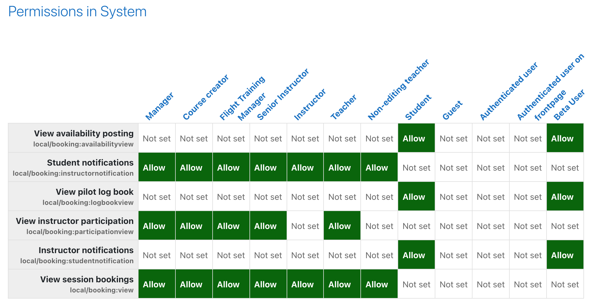

# Session booking

Copyright (c) 2021 Mustafa Hajjar Licensed under the GNU GPL v3 or later license (<http://www.gnu.org/copyleft/gpl.html>)

Session Booking is a [Moodle](https://moodle.org/) plugin that allows Aviation Training Organizations (ATO) manage instructor-led training sessions. It allows students to post their availability and instructors to book sessions according to student availability.

Session Booking provides a workflow for posting availability slots, booking against these slots, then grading the exercise. The plugin also allows course managers in assigning students to instructors.

## Highlights

- Allows instructors to book students based on their recorded availability
- Allows students to record and manage their weekly availability for sessions
- Allows course managers in assigning students to instructors
- Tracks instructor participation in conducting student sessions
- Tracks flight data and tracks student pilot log book entries
- Manages email communication between students and instructors
- Provides a dashboard for instructors and course administrators to visualize student progression throughout the course
- Provides a custom student prioritization mechanism for booking sessions based on student's session recency, course activity, availability posting, and lesson completion
- Session calendar integration with Moodle, Google, and Outlook Live calendars, including (ics) standard iCal calendar file download

## Setup

The plugin can be installed either directly from Moodle or through CLI.

### Moodle plugins install

1. Download [SessionBooking](https://github.com/zcodemonkeyz/SessionBooking/archive/refs/heads/main.zip) zip
2. Site administration > Plugins > Install plugins
3. Drop or upload the zip file

### CLI install

1. `$ cd [path-to-moodle]\local`
2. `$ mkdir booking`
3. `$ cd booking`
4. `$ git clone https://github.com/zcodemonkeyz/SessionBooking.git`

### Dependencies

- [Moodle 3.11](https://moodle.org/)
- [Robin Herbots Inputmask 5.x](https://github.com/RobinHerbots/Inputmask) (package already included in js folder)

## Configuration

There are three areas of configurations:

1. Plugin configuration (moodle administrators)

   - User custom fields (primary & secondary simulators, and callsign)
   - ## Session Booking Configurations:
   - Capability and role assignment: the plugin should have the same configuration as what is shown below. Note that the `Beta User` role is meant for beta rollout, afterwhich the `student` role should have the same capability as the `Beta User`:
     

2. Course configuration (course administrators)

3. User configuration (users)
   - Notifications
   - Primary Simulator
   - Secondary Simulator
   -

## Troubleshooting

-

## FAQ

- Q: How to adjust and tune student prioritization?
- A: In the plugin there are multiplier settings that allow higher multiplier score for weighing each student prioritization. The higher the multiplier the higher the weight of that setting in the overall score determining prioritization.

- Q: What happens when the plugin is uninstalled?
- A: The plugin follows Moodle standard for plugins and it is uninstalled completely from Moodle including associated data and configurations. The only addition that is left is the ATO category and simulators & callsign custom fields. If desired these can be removed from [Site administration > Users > User profile fields]

## Known Issues

- [BR00268]: Active Students does not show students after initial plugin install. Interim fix is to update user profile [SAVE] to persist added custom fields.
- [BR00254]: A user can copy slots and paste them into restricted period.

## Maintainers
